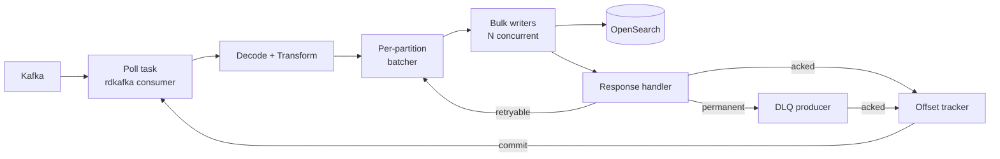
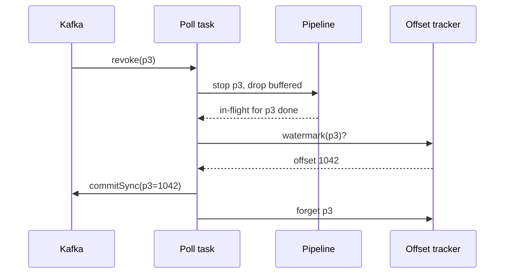

# opensearch-sink: Implementation Spec

Sep 24, 2026 · @Yuvraj Singh

## Overview

`opensearch-sink` is a Rust library crate, plus a thin binary, that consumes events from Kafka and writes them to OpenSearch through the `_bulk` API. It guarantees at-least-once delivery with idempotent writes, and it never drops data silently: every event ends up indexed, in a dead letter queue, or blocking the pipeline with an alert.

### Goals

- At-least-once delivery: offsets are committed only after OpenSearch (or the DLQ) acknowledges every document derived from them.
- Idempotent writes through deterministic document IDs, so replays overwrite instead of duplicating.
- Correct handling of partial bulk failures, retries with backoff, backpressure, rebalances and graceful shutdown.
- Pluggable transformation through a Rust trait, so business logic lives in user code, not a config DSL.
- Low footprint: single static binary, bounded memory, no JVM.
- First-class observability: Prometheus metrics, structured logs, health endpoints.

### Non-goals (v1)

- Exactly-once delivery end to end.
- Managing index templates, ISM policies or mappings. The operator creates these ahead of time.
- A general transformation DSL. Complex logic belongs in a `Transform` implementation.
- Avro, Protobuf and Schema Registry support. Planned for a later milestone, but the decoder must be pluggable from day one.
- Writing to sinks other than OpenSearch.

## Architecture and data flow

One poll task owns the Kafka consumer, and everything downstream runs as tokio tasks connected by bounded channels. An offset tracker is the single source of truth for what may be committed.



The pipeline, step by step:

1. **Poll task** receives records, registers each offset with the offset tracker as in flight, and forwards them. It keeps polling even when partitions are paused, so group membership stays healthy.
2. **Decode + Transform** turns a `SinkRecord` into zero or more `Document`s, or rejects it to the DLQ.
3. **Batcher** buffers documents per partition and flushes on `max_docs`, `max_bytes` or `linger`, whichever comes first.
4. **Bulk writers** serialize NDJSON, send `_bulk`, and hand the parsed response to the response handler.
5. **Response handler** classifies each item: success goes to the tracker, retryable items go back with backoff, permanent failures go to the DLQ.
6. **Offset tracker** advances each partition's commit watermark only past offsets that are fully resolved. The poll task commits the watermark periodically and synchronously on revoke and shutdown.
7. **Backpressure controller** watches buffered bytes and retry state and pauses or resumes partitions on the consumer.

Every event must reach exactly one terminal state: indexed, skipped by the transform, or written to the DLQ. Anything else means the offset is never committed.

## Crate layout and public API

The crate is a library first. The binary only loads config, wires a default JSON transform, and runs the sink.

```text
opensearch-sink/
  Cargo.toml
  src/
    lib.rs            // public exports, Sink builder
    config.rs         // typed config, defaults, validation
    consumer.rs       // rdkafka wrapper, rebalance context, pause/resume
    record.rs         // SinkRecord, Document, Action
    transform.rs      // Transform trait, default JSON transform
    router.rs         // index template rendering, doc ID strategies
    batch.rs          // per-partition batcher
    bulk/
      client.rs       // BulkClient trait + OpenSearch impl
      request.rs      // NDJSON builder, size-aware splitting
      response.rs     // bulk response parsing
    classify.rs       // error classification
    retry.rs          // backoff policy
    offsets.rs        // OffsetTracker
    dlq.rs            // DLQ producer
    backpressure.rs   // pause/resume controller
    metrics.rs
    health.rs         // /healthz, /readyz, /metrics server
    shutdown.rs
  src/bin/opensearch-sink.rs
  tests/              // integration tests (testcontainers)
  examples/           // custom transform example
```

### Core types

```rust
pub struct SinkRecord {
    pub topic: Arc<str>,
    pub partition: i32,
    pub offset: i64,
    pub key: Option<Bytes>,
    pub payload: Option<Bytes>,      // None = tombstone
    pub headers: Vec<(String, Bytes)>,
    pub timestamp: Option<i64>,      // ms since epoch
}

pub enum Action { Index, Create, Update { upsert: bool }, Delete }

pub struct Document {
    pub index: String,
    pub id: Option<String>,
    pub action: Action,
    pub body: Option<Bytes>,         // serialized JSON, None for Delete
    pub routing: Option<String>,
    pub version: Option<i64>,        // external versioning, optional
}

pub enum TransformOutcome {
    Emit(Vec<Document>),             // one record may produce many docs
    Skip,                            // intentionally dropped, offset acked
    Reject { reason: String },       // goes to DLQ
}

#[async_trait]
pub trait Transform: Send + Sync + 'static {
    async fn transform(&self, record: &SinkRecord) -> TransformOutcome;
}

#[async_trait]
pub trait BulkClient: Send + Sync + 'static {
    async fn bulk(&self, body: Bytes) -> Result<BulkResponse, TransportError>;
}
```

### Entry point

```rust
let sink = Sink::builder(config)
    .transform(MyTransform::new())   // optional, defaults to JsonTransform
    .build()?;
sink.run(shutdown_token).await?;    // returns on shutdown or fatal error
```

`BulkClient` exists so tests can mock OpenSearch. The default implementation uses the `opensearch` crate; if it gets in the way of sending raw NDJSON bytes, implement it directly on `reqwest` instead.

## Configuration

Config is a TOML file with environment variable overrides (`OS_SINK__SECTION__KEY`), deserialized into typed structs and validated at startup. Durations use humantime strings (`"30s"`).

| Key | Default | Notes |
| --- | --- | --- |
| `kafka.brokers` | required | Comma-separated bootstrap servers |
| `kafka.topics` / `kafka.topic_regex` | required, one of | Regex maps to librdkafka's `^` topic subscription |
| `kafka.group_id` | required |  |
| `kafka.auth` | `none` | `none`, `sasl_plain`, `sasl_scram`, `mtls`; `msk_iam` in a later milestone |
| `kafka.auto_offset_reset` | `earliest` |  |
| `kafka.extra` | `{}` | Raw librdkafka properties passthrough. `enable.auto.commit` is always forced to `false` |
| `decode.format` | `json` | `json` or `raw`; pluggable for Avro/Protobuf later |
| `routing.index` | required | Template, e.g. `logs-{field:service}-{ts:%Y.%m.%d}`; `{topic}` also supported |
| `routing.id_strategy` | `kafka_coordinates` | `kafka_coordinates` (`{topic}-{partition}-{offset}`), `key`, `field:<json.path>`, `none` |
| `routing.action` | `index` | `index`, `create`, `update`, `upsert` |
| `routing.on_tombstone` | `delete` | `delete` or `skip`; only valid with `key` or `field` ID strategy |
| `routing.external_version` | `false` | Uses the Kafka offset as `version` with `version_type=external_gte` |
| `batch.max_docs` | `1000` | Flush threshold |
| `batch.max_bytes` | `5 MiB` | Flush threshold; a single request is never larger |
| `batch.linger` | `1s` | Max time a doc waits in a buffer |
| `batch.max_in_flight` | `8` | Concurrent bulk requests across all partitions |
| `buffer.max_bytes` | `256 MiB` | Global memory cap; above it all partitions pause |
| `buffer.resume_ratio` | `0.5` | Resume when buffered bytes fall below cap × ratio |
| `opensearch.urls` | required | One or more node URLs |
| `opensearch.auth` | `none` | `none`, `basic`; `sigv4` in a later milestone |
| `opensearch.tls.ca_file` | none | Custom CA, optional client cert and key |
| `opensearch.timeout` | `30s` | Per bulk request |
| `opensearch.gzip` | `true` | Compress bulk bodies |
| `retry.initial_backoff` | `100ms` |  |
| `retry.max_backoff` | `30s` |  |
| `retry.multiplier` | `2.0` | Full jitter is always applied |
| `retry.max_attempts` | `10` | Per document, for retryable errors |
| `retry.on_exhausted` | `block` | `block` keeps retrying at max backoff and alerts; `dlq` sends to DLQ |
| `dlq.enabled` | `true` | If `false`, permanent failures block the partition |
| `dlq.topic` | required if enabled |  |
| `commit.interval` | `5s` | Periodic async commit of watermarks |
| `rebalance.revoke_timeout` | `20s` | Max wait for in-flight batches on revoke |
| `shutdown.grace` | `30s` | Max drain time on SIGTERM |
| `observability.listen` | `0.0.0.0:9464` | Serves `/metrics`, `/healthz`, `/readyz` |
| `observability.log_format` | `json` | `json` or `pretty` |

Validation rules: `on_tombstone = delete` requires a `key` or `field` ID strategy; `external_version = true` requires a `key` or `field` ID strategy; `batch.max_bytes` must be below the cluster's `http.max_content_length` (100 MiB default).

## Delivery semantics and offset tracking

The sink is at-least-once: a crash may replay events, and deterministic document IDs turn those replays into overwrites.

### Offset tracker rules

- Each assigned partition has its own state: the set of in-flight offsets and the highest offset seen.
- An offset becomes resolved when every document derived from it is acked by OpenSearch, or the record is skipped, or the record is confirmed written to the DLQ. A record that emits N documents keeps a pending counter of N.
- The commit watermark is the lowest unresolved offset. If none is unresolved, it is highest seen + 1. Kafka commits store the next offset to read, so never commit an offset that is still unresolved.
- Resolution can happen out of order; the watermark only moves forward over a contiguous resolved prefix.
- Commits are async every `commit.interval`, and sync on revoke and shutdown.
- Tracker state for a partition is discarded on revoke. Records that arrive for a partition no longer assigned (stale generation) are ignored, not acked.

### Ordering

- By default each partition has at most one bulk request in flight. Batches for a partition are sent strictly in order, while different partitions proceed in parallel up to `batch.max_in_flight`.
- This preserves Kafka's per-partition order in OpenSearch, so the last write for a document ID wins correctly without versioning.
- Retries of a batch happen before the next batch for that partition is sent.
- With `routing.external_version = true`, the Kafka offset is sent as the document version and stale writes are rejected by OpenSearch, which makes ordering safe even under replay.

### Document IDs

| Strategy | ID | Use when |
| --- | --- | --- |
| `kafka_coordinates` | `{topic}-{partition}-{offset}` | Append-only events, logs |
| `key` | Kafka key as UTF-8 | Entity streams keyed by ID, CDC |
| `field:<path>` | Value at a JSON path | The ID lives in the payload |
| `none` | OpenSearch auto-ID | Only when duplicates are acceptable; replays will duplicate |

IDs longer than 512 bytes are rejected by OpenSearch; the router must hash them (SHA-256 hex) instead of failing.

## Errors, retries, backpressure and DLQ

Every failure is classified into exactly one of: retry, success, split, DLQ, or fatal. The classifier is a pure function and must be table-tested.

### Classification

| Condition | Class | Handling |
| --- | --- | --- |
| Transport error, timeout, connection refused | Retry whole request | Backoff, pause partition while retrying |
| HTTP 429, 502, 503, 504 on the request | Retry whole request | Backoff, signal backpressure |
| HTTP 401, 403 | Retry, alert | Max backoff, error log, never DLQ (credentials may be fixed) |
| HTTP 413 | Split | Halve the batch and resend; a single doc still too large goes to DLQ |
| HTTP 200 with `errors: false` | Success | Ack all items |
| Item 429 (`es_rejected_execution_exception`) | Retry item | Only failed items are resent |
| Item 5xx | Retry item |  |
| Item 400 (`mapper_parsing_exception`, `illegal_argument_exception`, `document_parsing_exception`) | DLQ |  |
| Item 404 on `delete` | Success | Already gone |
| Item 404 `document_missing_exception` on `update` | DLQ |  |
| Item 409 on `create` or with external versioning | Success | Already written or stale |
| Decode failure or `TransformOutcome::Reject` | DLQ |  |
| Unknown status | Retry item | Log at warn with the raw error |
| Retries exhausted | Per `retry.on_exhausted` | `block` or `dlq` |

Parsing the bulk response must use the `errors` flag only as a shortcut; item results are matched to documents by position.

### Backoff

Exponential with full jitter: `sleep = random(0, min(max_backoff, initial_backoff * multiplier^attempt))`. Attempt counts are tracked per document, not per request.

### Backpressure

- Buffered bytes across all batchers are tracked in one atomic counter.
- Above `buffer.max_bytes`, pause every assigned partition with `consumer.pause`. Resume when below `max_bytes * resume_ratio`.
- A partition whose batch is retrying is paused individually until the batch resolves.
- The poll task keeps calling `recv` while paused, so `max.poll.interval.ms` is never exceeded and rebalances are still processed.
- A 429 storm must slow consumption, never drop documents.

### DLQ

- Produced with an idempotent producer, `acks=all`.
- Message key and value are the original Kafka key and payload bytes, untouched.
- Headers: `dlq.source.topic`, `dlq.source.partition`, `dlq.source.offset`, `dlq.error.class`, `dlq.error.reason`, `dlq.error.status`, `dlq.attempts`, `dlq.failed_at`.
- An offset is resolved only after the DLQ delivery report confirms the write. If the DLQ produce fails, it is retried with backoff and the partition stays blocked.
- Replay is out of scope for v1; running the sink against the DLQ topic after a fix is the intended path.

## Rebalance and shutdown

On revoke the sink finishes what is in flight, drops what is only buffered, and commits; on shutdown it drains everything within a grace period.

### Rebalance

- Use `partition.assignment.strategy = cooperative-sticky`, so only moving partitions are revoked.
- Implement a custom rdkafka `ConsumerContext`. `pre_rebalance` and `post_rebalance` run on the poll thread, so they communicate with the pipeline through channels and wait with `rebalance.revoke_timeout`. Pipeline tasks must never depend on the poll task to make progress, or this deadlocks.
- **On revoke:** stop routing new records for those partitions; drop their unsent buffered documents (the new owner re-reads them); wait for their in-flight bulk requests up to the timeout; commit their watermarks synchronously; discard their tracker state.
- **On assign:** create fresh tracker state and batchers. The starting position comes from the committed offset.
- Each assignment gets a generation number. Acks or records tagged with an old generation are discarded.



### Graceful shutdown

1. SIGTERM or SIGINT cancels a `CancellationToken`.
2. Pause all partitions; stop accepting new records.
3. Flush every batcher and wait for in-flight requests and DLQ writes, up to `shutdown.grace`.
4. Commit all watermarks synchronously.
5. Close the consumer so it leaves the group cleanly, and flush the DLQ producer.
6. Exit 0 if everything drained, non-zero if the grace period expired. Undrained events are safe because their offsets were never committed.

### Fatal errors

Unrecoverable consumer errors, invalid config, or a panicked task: log, attempt a best-effort commit of the current watermarks, and exit non-zero. Restarting is the orchestrator's job.

## Observability

Prometheus metrics via the `metrics` crate and `metrics-exporter-prometheus`, structured logs via `tracing`, and HTTP health endpoints on `observability.listen`.

### Metrics

| Metric | Type | Labels |
| --- | --- | --- |
| `sink_records_consumed_total` | counter | topic, partition |
| `sink_docs_written_total` | counter | index, action |
| `sink_records_skipped_total` | counter | topic |
| `sink_bulk_requests_total` | counter | status |
| `sink_bulk_duration_seconds` | histogram |  |
| `sink_bulk_body_bytes` | histogram |  |
| `sink_bulk_docs` | histogram |  |
| `sink_item_errors_total` | counter | class, reason |
| `sink_retries_total` | counter | class |
| `sink_dlq_records_total` | counter | reason |
| `sink_buffer_bytes` | gauge |  |
| `sink_partitions_paused` | gauge |  |
| `sink_uncommitted_records` | gauge | topic, partition |
| `sink_consumer_lag` | gauge | topic, partition (from librdkafka statistics) |
| `sink_commits_total` | counter | result |
| `sink_rebalances_total` | counter | kind (assign, revoke) |

`sink_consumer_lag` comes from librdkafka's statistics callback, enabled with `statistics.interval.ms = 15000`. Label cardinality must stay bounded: never use document IDs or raw error messages as labels.

### Logs and tracing

- JSON logs by default. One span per bulk request with batch ID, partition, doc count, bytes and attempt.
- Rebalances, pauses, resumes, commits and DLQ writes log at info; retries at warn with the error class; fatal paths at error.

### Health

- `/healthz`: process alive and poll loop ticked within the last 30s.
- `/readyz`: consumer has joined the group and the last OpenSearch request succeeded within the last 60s, or no request has been needed yet.
- `/metrics`: Prometheus scrape.

## Testing and acceptance criteria

Correctness under failure is the product, so failure scenarios get integration tests, not just the happy path.

### Unit tests

- **Offset tracker:** property tests with `proptest`. For any random order of resolutions, the committed watermark never exceeds the lowest unresolved offset and always reaches highest + 1 once all resolve.
- **Bulk response parser:** fixtures with mixed item results, positional matching, missing fields.
- **Classifier:** table-driven test covering every row of the classification table.
- **Backoff:** bounds and jitter range.
- **Router:** index template rendering, ID strategies, long ID hashing, tombstone handling.
- **Request builder:** NDJSON correctness, size-aware splitting, 413 halving down to one document.
- **Bulk client:** `wiremock` for 429, 413, 5xx, partial failures and timeouts.

### Integration tests

Use `testcontainers` with a Kafka container (Apache Kafka or Redpanda) and a single-node OpenSearch. Use `toxiproxy` or `docker pause` for fault injection.

| Scenario | Pass condition |
| --- | --- |
| Happy path, 100k events | Index doc count equals produced count |
| Kill sink mid-stream, restart | No missing docs; duplicates collapse by ID |
| OpenSearch paused 60s | Partitions pause, lag grows, full recovery, no loss |
| Mapping conflict on some docs | Those go to DLQ with correct headers; others indexed; offsets advance |
| Oversized doc | 413 split path, doc lands in DLQ |
| Scale 1 → 3 → 1 instances during load | Final count equals produced count |
| SIGTERM under load | Exit 0 within grace, committed offsets match indexed docs |
| DLQ topic unavailable | Affected partition blocks, no offset committed past the failure |
| Tombstones with `key` strategy | Docs deleted |

### Acceptance criteria

- [ ] All integration scenarios above pass in CI.
- [ ] `cargo clippy --all-targets -- -D warnings` and `cargo fmt --check` are clean.
- [ ] No `unwrap` or `expect` outside tests and startup config validation.
- [ ] Memory stays below `buffer.max_bytes` plus a fixed overhead during the OpenSearch pause test.
- [ ] Every public item has rustdoc; README shows config and a custom `Transform` example.
- [ ] A throughput baseline is recorded with `criterion` for the request builder and in an end-to-end local run. Target numbers are an open question.

## Milestones and instructions for Claude Code

Build in the order below; each milestone ends with green tests and a working binary.

### Milestones

| # | Scope | Done when |
| --- | --- | --- |
| M1 | Skeleton, config loading and validation, poll loop, JSON transform, batcher, bulk client, happy path | Happy path integration test passes |
| M2 | Offset tracker, manual commits, ID strategies, per-partition ordering | Kill and restart test passes with no loss |
| M3 | Bulk response parsing, classifier, per-item retries, backoff, 413 splitting | Classifier table tests and wiremock tests pass |
| M4 | DLQ producer with headers, delivery-confirmed resolution | Mapping conflict and DLQ unavailable tests pass |
| M5 | Backpressure, rebalance context, generations, graceful shutdown | Pause, scale and SIGTERM tests pass |
| M6 | Metrics, logging, health endpoints | Metrics visible and correct in the integration tests |
| M7 | README, rustdoc, examples, criterion baseline | Acceptance criteria all checked |
| Later | Avro/Protobuf with Schema Registry, SigV4, MSK IAM, replay CLI | Separate spec |

### Dependencies

- Runtime: `tokio`, `tokio-util` (CancellationToken), `rdkafka` (features `cmake-build`, `ssl`), `opensearch` (or `reqwest`), `serde`, `serde_json`, `bytes`, `async-trait`, `thiserror`, `anyhow` (binary only), `tracing`, `tracing-subscriber`, `metrics`, `metrics-exporter-prometheus`, `figment` or `config`, `humantime-serde`, `rand`, `sha2`, `axum` or `hyper` for the health server.
- Dev: `testcontainers`, `testcontainers-modules`, `proptest`, `wiremock`, `criterion`.
- Adding anything else needs a one-line justification in the PR description.

### Rules for Claude Code

- Work one milestone at a time. Do not start the next until `cargo build`, `cargo test`, `cargo clippy --all-targets -- -D warnings` and `cargo fmt --check` all pass.
- Every error path must end in retry, DLQ, skip or fatal exit. A code path that silently drops a document is a bug.
- Never commit an offset from anywhere except the offset tracker's watermark.
- Never block inside async tasks; the rebalance callbacks are the only place allowed to wait synchronously, with a timeout.
- Library errors use `thiserror` enums; `anyhow` only in the binary. No `unwrap` or `expect` outside tests.
- Write tests alongside each module, not at the end.
- Keep public API changes minimal and documented. Stop and ask before changing anything in the delivery semantics section.
- Keep this spec in the repo as `SPEC.md` and reference it from `CLAUDE.md`. If implementation reveals a spec gap, update `SPEC.md` in the same PR.

### Open questions

- Target throughput and latency numbers for the benchmark.
- Which OpenSearch versions must be supported (2.x only, or 3.x too).
- Whether batches should mix partitions to get larger bulks at low per-partition volume.
